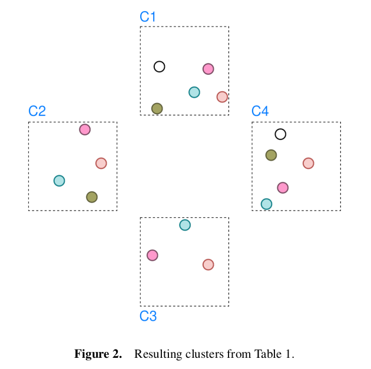

# Cross Camera Data Association using Supervised Clustering GNN
## Introduction
This project is an attempt to apply *[Hi-LANDER](https://arxiv.org/abs/2107.01319)* (one of methods of Graph Neural Network for Supervised Graph Clustering ) to the cross-camera instance matching. The full report can be found [here](https://arxiv.org/abs/2410.00643).<br>
The specific task in this project is connecting persons across the different views in different environments:
<p align="center">

</p>

## Method
### Graph Creation
The input structure for this method is a directed graph $G = (V,E)$, where
$V = \{v_i \mid i \in [1, N]\}$ represents the set of nodes denoting all pedestrian
bounding boxes. Each node is depicted by embedding $h_i$ initialized with
appropriate, normalized feature $f_i$, forming node embeddings set $H = \{h_i \mid i \in [1, N]\}$.
For each node of camera $c_i$, we find the **one closest neighbor from each other camera
view** $c_j, j \neq i$ (green arrows in the cell $(l_1, a)$ in **Table 1** between C1 and C2, the same way for each other cameras pair - black arrows), unlike *Hi-LANDER*
which applies pure kNN over the whole corpus of nodes. This neighbor selection per camera is related to the setup where the pedestrian can appear mostly once in each view.

### Graph Encoding
Using $h_i$ as the input embedding of the node $v_i$, GCN
encodes it as a new node embedding $h_i'$ in the following way:

$$h_i' = \phi(h_i, \sum_{v_j \in N_{v_i}} w_{ji}\psi(h_j))$$

where $\phi$ and $\psi$ are MLPs, $w_{ji}$ is a trainable vector. $N_{v_i} = \{v_j, (v_j, v_i) \in E\}$
is the neighborhood of node $v_i$, defined with the set of incoming edges.

GCN encoder can be applied multiple times on the same graph, so the effect of the number of message passing steps is also explored in this work.

<p align="center">

</p>

### Linkage Prediction and Node Density
After the Graph Encoding step, resulting node features $H'$ are used to predict the linkage between nodes. The edge $(v_i, v_j)$ connectivity is predicted by applying MLP classifier $\theta$. The input is a vector created from **concatenated node features** ($h_i', h_j'$) and **nodes' ground plane positions**
$(\hat{x_i}, \hat{y_i})$, $(\hat{x_j}, \hat{y_j})$.
The original work considers the concatenation of node features only.
The output is a sigmoid activation which estimates the probability that two connected nodes have the same label.
```math
\hat{r}_{ij} = P(r_i = r_j) = \sigma(\theta([h_i', \hat{x_i}, \hat{y_i}, h_j', \hat{x_j}, \hat{y_j}]^T))
```

A node density $d_i$ is the value that depicts the weighted partition of neighbors which have the
same label as the node $v_i$. Its estimation is defined as:

```math
\hat{d_i} = \frac{1}{k}\sum_{j=1}^{k}\hat{e}_{ij}a_{ij}
```

where $a_{i,j} = \langle h_i, h_j \rangle$ is the similarity of nodes' embeddings, and
$\hat{e}_{ij}$ is the edge coefficient defined as:

```math
\hat{e}_{ij} = P(r_i = r_j) - P(r_i \neq r_j).
```

### Graph Decoding
After an estimation of the graph attributes (node density and edge coefficient) using the GNN encoder,
it is possible to find connected components of the graph in the next two steps:

**Edge filtering**: We initialize a new edge set $E' = \emptyset$. The subset of
outgoing edges for each node $v_i$ are created as

```math
\varepsilon(i) = \{j \mid (v_i, v_j) \in E \wedge \hat{d}_i \leq \hat{d}_j \wedge \hat{r}_{ij} \geq p_{\tau}\}
```

where

```math
\hat{r}_{ij}=P(r_i=r_j)
```

and $p_{\tau}$ is the edge connection threshold. Each node
with non-empty $\varepsilon_i$ contributes to the set $E'$ with one edge selected as

```math
j=argmax(\hat{e}_{ik}), k \in \varepsilon(i)
```

The edge $(v_i, v_j)$ is added to the $E'$. With the condition $\hat{d}_i \leq \hat{d}_j$
authors of *Hi-LANDER* introduced an inductive bias to discourage connection to nodes on the border of
clusters.

**Peak nodes**: The set of edges $E'$ defines new, refined graph $G'$
(cell $(l_1, b)$ in **Table 1**) on the same set of nodes. The peak nodes are those without outgoing edges.
They have a maximum density in the neighborhood. The way $G'$ is created implies
a separation of the graph in the set of connected components $Q = \{q_i \mid i \in [1, Z]\}$.
Consequently, each connected component has one peak node distinguished by the highest
density in the connected component (cell $(l_1, c)$ in **Table 1**).

### Hierarchical Design
The whole pipeline explained in previous sections can be repeated
on the final set of peak nodes as a new input (row $l_2$ in **Table 1**).
Multi-level approach demands an aggregation of the features for each connected component from the level $l$, which is replaced with a single node on the level $l + 1$. The node embeddings of the next level is defined as a concatenation of the peak node features and the mean node features:

```math
h^{(l + 1)}_i = [\tilde{h}^{(l)}_{q_{i}}, \bar{h}^{(l)}_{q_{i}}].
```

### Lables back-propagation
Once the algorithm finishes and we obtained the final set of peak nodes, their labels can be propagated back to the all nodes in the belonging connected components. For the example in the **Table 1** the final parition is given as different node colors on the following figure:

<p align="center">

</p>

## Requirements
In the docker directory run:
```bash
docker build --rm --no-cache -t sgc-cca:v_1 -f Dockerfile .
```

## Citation
If you use this software in your work, please cite it using:<br>
```
@misc{nedeljković2024crosscameradataassociationgnn,
      title={Cross-Camera Data Association via GNN for Supervised Graph Clustering}, 
      author={Đorđe Nedeljković},
      year={2024},
      eprint={2410.00643},
      archivePrefix={arXiv},
      primaryClass={cs.CV},
      url={https://arxiv.org/abs/2410.00643}, 
}
```