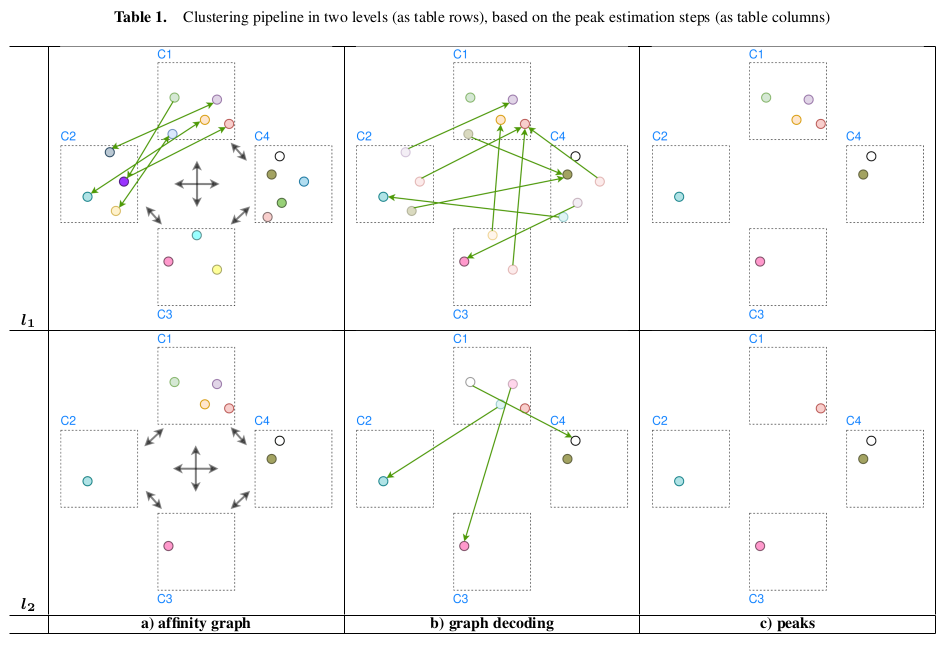

# Cross Camera Data Association using Supervised Clustering GNN
## Introduction
This project is an attempt to apply *[Hi-LANDER](https://arxiv.org/abs/2107.01319)* (one of methods of Graph Neural Network for Supervised Graph Clustering ) to the cross-camera instance matching. The full report with all details can be found in the document `report.pdf`. <br>
The specific task in this project is connecting persons across the different views in different environments:
<p align="center">

</p>

## Method
### Graph Encoding
Using $h_i$ as the input embedding of the node $v_i$, GCN
encodes it as a new node embedding $h_i'$ in the following way:

$$h_i' = \phi(h_i, \sum_{v_j \in N_{v_i}} w_{ji}\psi(h_j))$$

where $\phi$ and $\psi$ are MLPs, $w_{ji}$ is a trainable vector. $N_{v_i} = \{v_j, (v_j, v_i) \in E\}$
is the neighborhood of node $v_i$, defined with the set of incoming edges.

GCN encoder can be applied multiple times on the same graph, so the effect of the number of message passing steps is also explored in this work.

<p align="center">

</p>

### Linkage Prediction and Node Density
After the Graph Encoding step, resulting node features $H'$ are used to predict the linkage between nodes. The edge $(v_i, v_j)$ connectivity is predicted by applying MLP classifier $\theta$ The input is a vector created from **concatenated node features** ($h_i', h_j'$) and **nodes' ground plane positions**
$(\hat{x_i}, \hat{y_i})$, $(\hat{x_j}, \hat{y_j})$.
The original work considers the concatenation of node features only.
The output is a sigmoid activation which estimates the probability that two connected nodes have the same label.
```math
\hat{r}_{ij} = P(r_i = r_j) = \sigma(\theta([h_i', \hat{x_i}, \hat{y_i}, h_j', \hat{x_j}, \hat{y_j}]^T))
```

A node density $d_i$ is the value that depicts the weighted partition of neighbors which have the
same label as the node $v_i$. Its estimation is defined as:

```math
\hat{d_i} = \frac{1}{k}\sum_{j=1}^{k}\hat{e}_{ij}a_{ij}
```

where $a_{i,j} = \langle h_i, h_j \rangle$ is the similarity of nodes' embeddings, and
$\hat{e}_{ij}$ is the edge coefficient defined as:

```math
\hat{e}_{ij} = P(r_i = r_j) - P(r_i \neq r_j).
```

### Graph Decoding
After an estimation of the graph attributes (node density and edge coefficient) using the GNN encoder,
it is possible to find connected components of the graph in the next two steps:

**Edge filtering**: We initialize a new edge set $E' = \emptyset$. The subset of
outgoing edges for each node $v_i$ are created as

```math
\varepsilon(i) = \{j \mid (v_i, v_j) \in E \wedge \hat{d}_i \leq \hat{d}_j \wedge \hat{r}_{ij} \geq p_{\tau}\}
```

where $\hat{r}_{ij} = P(r_i = r_j)$ and $p_{\tau}$ is the edge connection threshold. Each node
with non-empty $\varepsilon_i$ contributes to the set $E'$ with one edge selected as

```math
j = \argmax_{k \in \varepsilon(i)} \hat{e}_{ik}
```

The edge $(v_i, v_j)$ is added to the $E'$. With the condition $\hat{d}_i \leq \hat{d}_j$
authors of *Hi-LANDER* introduced an inductive bias to discourage connection to nodes on the border of
clusters.

**Peak nodes**: The set of edges $E'$ defines new, refined graph $G'$
(cell $(l_1, b)$ in **Table 1**) on the same set of nodes. The peak nodes are those without outgoing edges.
They have a maximum density in the neighborhood. The way $G'$ is created implies
a separation of the graph in the set of connected components $Q = \{q_i \mid i \in [1, Z]\}$.
Consequently, each connected component has one peak node distinguished by the highest
density in the connected component (cell $(l_1, c)$ in **Table 1**.

## Requirements
In the docker directory run:
```bash
docker build --rm --no-cache -t sgc-cca:v_1 -f Dockerfile .
```